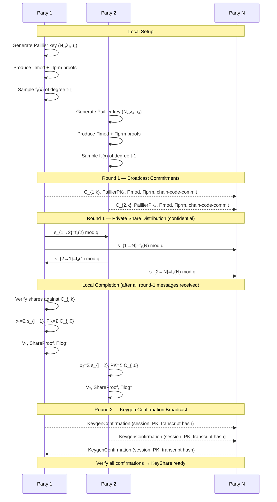
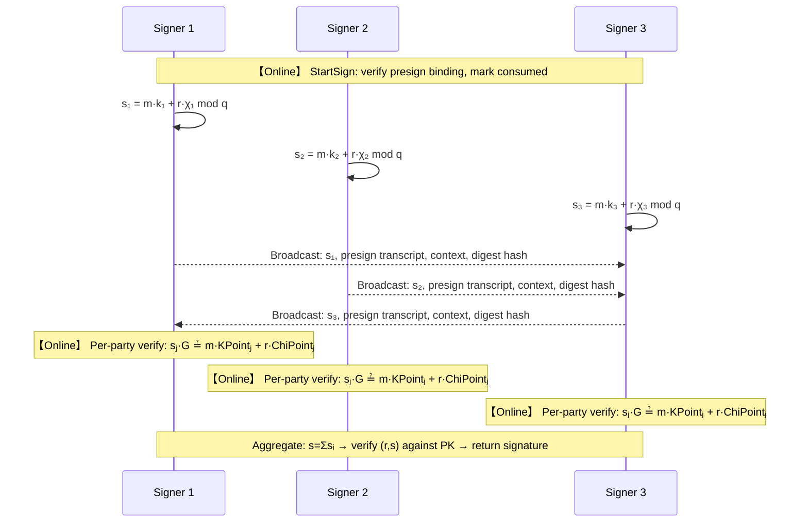
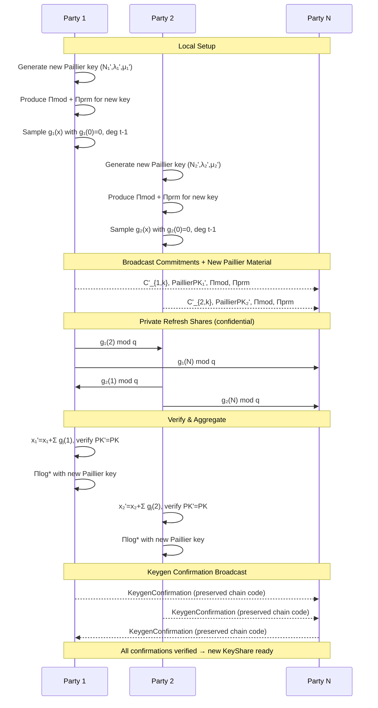
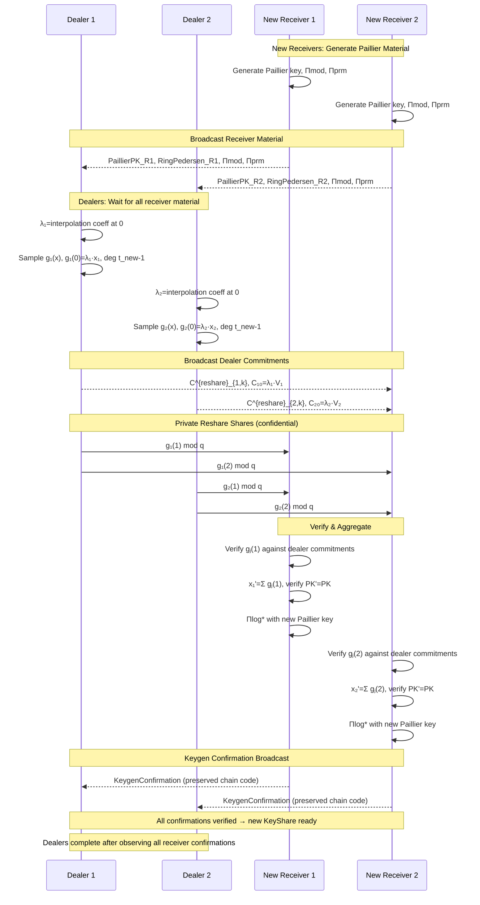

# CGGMP21 secp256k1

The `cggmp21/secp256k1` package implements a ([CGGMP21-style](https://eprint.iacr.org/2021/060)) threshold ECDSA protocol over the secp256k1 curve.

## Protocol Overview

| Phase   | Rounds | Description                                                                  |
| ------- | ------ | ---------------------------------------------------------------------------- |
| Keygen  | 2      | DKG with Paillier key setup, ZK proofs, and mandatory confirmation evidence. |
| Presign | 3      | Offline phase: nonce sharing via MtA, produces `Presign` record.             |
| Sign    | 1      | Online phase: fast single-round partial signature exchange.                  |
| Refresh | 1      | Key-share refresh with Paillier key rotation; fixed party set and threshold. |
| Reshare | 1      | Party-set/threshold resharing with old dealers and new receivers.            |

The signing path never transmits or reconstructs private key shares or nonce shares. Each presign record is strictly one-use; reuse is caught before any partial signature leaves the process.

## Session Transition Contract

CGGMP21 keygen, presign, and online-sign handlers follow:

```text
decode -> policy validate -> cryptographic verify -> prepare transition -> commit -> effects
```

Rejected messages do not mutate accepted protocol state or emit envelopes.
Decoded secret scalars and prepared MtA, key-share, presign, or signature values
remain owned by the transition until commit and are destroyed if abandoned.
Outbound envelopes are constructed before their authorizing state is committed.
Identical duplicates never reapply state; conflicting duplicates are rejected
without replacing accepted values. Presign readiness is derived from per-party
round state rather than message counters.

Online partial verification and final ECDSA aggregation are independent of the
durable store. A sign-attempt coordinator owns claim, load/resume, delivery,
completion, and burn operations and validates that returned records preserve the
same presign and attempt identity. The current store handle is derived from
an internal secret-tainted `contentID`. Store implementations must derive an
opaque store-local key before using that value for paths, indexes, metadata, or
other durable identifiers.

## Production Run Recipes

The recipes below describe production integration metadata. They do not add a
new library API. A shared plan means equivalent authenticated run metadata, not
a shared Go object.

### CGGMP21 KeygenRun

Public run metadata:

- Fresh session ID generated once for the keygen run.
- Parties.
- Threshold.
- Optional security parameters.

Each party validates the metadata, reconstructs `NewKeygenPlan`, records the
plan digest acceptance, builds an `EnvelopeGuard` for
`tss.ProtocolCGGMP21Secp256k1` and the same session ID, calls `StartKeygen`
locally, and routes outbox envelopes. Inbound envelopes are dispatched to
`KeygenSession.Handle`.

`KeygenSession.KeyShare()` returns a key share only after the confirmation round
completes. The local `KeyShare` must be encrypted and durably persisted before
the control plane marks the party complete or the key usable.

### CGGMP21 PresignRun

Public run metadata:

- Fresh presign session ID.
- Key ID or key generation ID.
- Signer set.
- `PresignContext`.

Each signer loads its local `KeyShare`, validates that it owns a share for the
requested generation, validates signer-set threshold and membership,
reconstructs `NewPresignPlan`, calls `StartPresign` locally, and routes
inbound envelopes through `PresignSession.Handle`.

`PresignSession.Presign()` returns the completed local record. Persist the
encrypted `Presign` before exposing it to inventory. A completed presign is a
per-party local record; there is no shared presign object across machines.

### CGGMP21 SignRun

Public run metadata:

- Fresh signing session ID.
- Key ID.
- Local inventory ID for the encrypted presign record. This application ID must
  not be the internal secret-derived content commitment.
- Signer set exactly matching the presign binding.
- `SignRequest` intent including message or digest, context, LowS policy, and
  `AttemptStore`.

Each signer loads the local `KeyShare` and local `Presign`, verifies the presign
is not consumed locally, reconstructs `NewSignPlan`, calls `StartSign`, and
routes inbound envelopes through `SignSession.Handle`.

The signing session ID identifies the online signing attempt, not the earlier
presign run. `StartSign` must commit through `SignAttemptStore` before releasing
outbound envelopes. If the commit outcome is unknown, the presign is
operationally consumed; do not reuse it with a different session ID or digest.
Recover the same attempt with the same request and `ResumeSign`.

`SignSession.Signature()` is the completion accessor. Persist completion before
making the signature visible to request handlers.

### CGGMP21 RefreshRun

Public run metadata:

- Fresh refresh session ID.
- Current key generation ID.
- Same party set and threshold.
- Current generation public metadata.

Each party reconstructs `NewRefreshPlan` from its current local `KeyShare` and
the shared session ID, calls `StartRefresh`, routes
`RefreshSession.Handle`, and obtains the staged output through
`RefreshSession.KeyShare()`.

Install the refreshed share only with compare-and-swap against the expected
current key generation. Do not overwrite if the local current share changed.

### CGGMP21 ReshareRun

Public run metadata:

- Fresh reshare session ID.
- Old key generation ID.
- Dealer parties.
- New parties.
- New threshold.
- Old public key, chain code, and verification shares from the current key
  generation.

Old-only parties call `StartReshareDealer`. New-only parties call
`StartReshareReceiver`. Overlap parties call `StartReshareOverlap`. All roles
route `ReshareSession.Handle`.

New receiver parties persist the new `KeyShare` returned by
`ReshareSession.Result()`. Old-only parties do not install a new share. The
control plane retires the old key generation only after the required
new-generation commit condition is satisfied.

## KeyShare API and Ownership

`KeyShare` is an opaque handle. All protocol state, including public metadata,
is stored in private package state so callers cannot invalidate a validated
share by mutating slices or nested records.

Scalar metadata is exposed by value through `PartyID()` and `Threshold()`.
Global public metadata is exposed through `PublicMetadata()`, which returns a
caller-owned `KeySharePublicMetadata` snapshot. Participant-scoped material is
queried by party ID through `VerificationShare(party)`,
`PaillierPublicShare(party)`, `RingPedersenPublicShare(party)`, and
`KeygenConfirmation(party)`. Those APIs return deep-copy snapshots and report
absence with `false`.

The serialized share stores each participant's verification share, Paillier
public key/proof, Ring-Pedersen parameters/proof, and final keygen confirmation
in one party-keyed map. Its keys must exactly equal `Parties`; missing, extra,
or broadcast-party entries are rejected. The wire codec sorts map keys
canonically, while snapshots, transcript inputs, hashes, and confirmation sets are
materialized in `Parties` order. `GroupCommitments` remains an ordered list by
polynomial degree, not a party-keyed map. This wire change is intentionally not
backward compatible; persisted shares using the retired record-list layout must
be regenerated.

The local secp256k1 share is stored as `internal/secret.Scalar` fixed-length
bytes. `String()`, `GoString()`, `Format()`, and `MarshalJSON()` redact or reject
secret material. `Destroy()` zeroes package-owned secret material in place. A
shallow Go copy is another handle to the same lifecycle state, so destroying
either handle destroys both. `Complete()` and session `KeyShare()` accessors
return independently owned shares that must each be destroyed separately.

### MPC Material Requirement

CGGMP21 key shares require full Paillier/ZK material and a complete keygen confirmation evidence set for the signing path. `requireMPCMaterial()` calls `Validate()`, which verifies every embedded `KeygenConfirmation` against the local keygen transcript, then checks that every party's Paillier public key is deserializable. Unconfirmed shares are rejected.

## Keygen

### Phase 1: Per-Party Setup

Each party `i`:

1. **Paillier key generation**: Generates a Paillier keypair `(N_i, λ_i, μ_i)` with safe primes `p ≡ q ≡ 3 mod 4`. The production default modulus size and minimum are 3072 bits; tests may override this to reduced sizes.

2. **ZK proofs**: Produces proofs bound to the keygen session domain:
   - **Πmod** — CGGMP24 Paillier-Blum modulus proof.
   - **Πprm** — CGGMP24 Ring-Pedersen parameter proof for `(N_i,s_i,t_i)`.

3. **Shamir polynomial**: Samples a random degree `t-1` polynomial:

   ```
   f_i(x) = a_{i,0} + a_{i,1}·x + … + a_{i,t-1}·x^{t-1}  mod q
   ```

   where `t` is the threshold and `q` is the secp256k1 order.

4. **HD chain code** (optional): Generates a random 32-byte chain-code share.

### Phase 2: Broadcast Commitments

Each party broadcasts:

- Polynomial commitments `C_{i,k} = a_{i,k}·G` for `k ∈ [0, t-1]`.
- Paillier public key (TLV-encoded).
- Π^fac proof.
- Π^prm proof.
- Optional chain-code share.

All bundled in a single `keygenCommitmentsPayload`.

### Phase 3: Private Share Distribution

Each party sends private Shamir shares to every other party:

```
s_{i→j} = f_i(j)  mod q
```

Sent as a direct confidential message (`To != 0`, transport must report `ChannelConfidential` in `ReceiveInfo`).

### Phase 4: Completion

When all `n` parties' commitments and shares are received and verified:

1. **Share verification**: Each `s_{i→j}` checked against `C_{i,k}` via the standard Shamir commitment check.

2. **Secret aggregation**: `x_j = Σ_i s_{i→j} mod q`.

3. **Group public key**: `PK = Σ_i C_{i,0}` (aggregated degree-zero commitments).

4. **Verification shares**: `V_p = Σ_{k=0}^{t-1} (p^k · GC_k)` where `GC_k = Σ_i C_{i,k}`.

5. **Schnorr share proof**: Each party proves knowledge of `x_j` such that `V_j = x_j·G`, bound to the keygen transcript hash.

6. **Chain code** (HD): `chain = XOR_i chainCode_i`.

7. **Paillier proof domain**: The persisted local Π^fac is re-proved against `(PK, keygen_transcript_hash)` for out-of-context detection.

8. **Πlog\* proof**: Each party encrypts its aggregated secret share `x_j` under its own Paillier key and produces a Πlog\* proof (LogStarProof) binding the ciphertext to the party's verification share `V_j`, using the party's own Ring-Pedersen parameters for the commitment. This allows re-verification on load to detect out-of-context or tampered share material.

At this point the session has only local pending material. It is not a usable `KeyShare` and cannot be serialized, presigned with, signed with, or reshared.

### Phase 5: Keygen Confirmation

Each party broadcasts `cggmp21.secp256k1.keygen.confirmation` in keygen round 2. The payload is a canonical binary `KeygenConfirmation` binding the session ID, sender, threshold, ordered party set, group public key, keygen transcript hash, and commitments hash.

The keygen session stores one canonical confirmation under each sender's party
key. Only after the full set verifies does `Complete()`/`KeyShare()` return a
`KeyShare`. Ordered confirmation operations still materialize the set in
`Parties` order. The serialized key share contains the full confirmation
evidence set; old records without this evidence or using the retired
record-list key-share layout are invalid.

### Domain Separation

```
keygenCommitmentsHashLabel = "cggmp21-secp256k1-keygen-commitments-v1"
keygenTranscriptHashLabel  = "cggmp21-secp256k1-keygen-transcript-v1"
```

Proof labels identify both the lifecycle phase and proof relation. Proof domains
bind `(protocol, version, label, session, threshold, parties, sender, receiver,
paillier_pubkey, lifecycle_plan_hash)` plus the phase-specific signer set,
statement public key, Ring-Pedersen parameters, key transcript hash, and presign
context. MtA delta and sigma responses use distinct labels.

All repository-defined CGGMP21 SHA-256 domains, transcripts, commitments,
challenges, evidence digests, reshare-plan digests, and presign identifiers use
the canonical labeled-entry encoding in [`wire.md`](wire.md). The domain is
always the first entry; party sets are sorted canonical uint32 lists, and
repeated party-scoped records bind the party ID before their public fields.

## Presign (Offline Phase)

Presign produces a one-use opaque `Presign` record containing local nonce shares
and per-party verification material. It must be run in advance of signing and
the result persisted securely. Global public metadata is available through
`PublicMetadata()`, which returns a caller-owned `PresignPublicMetadata`
snapshot. Per-signer verification material is internal to the opaque presign
record and is not exposed as a public accessor. Nested derivation paths and
public encodings returned through metadata are deep copied. A shallow Go copy
shares the same secret and consumed lifecycle state and cannot bypass
`Destroy()` or one-use claiming.

`PresignSession.Presign()` returns an independently owned completed record so
callers can persist or hand it to the online signer without mutating
session-owned material.

Each internal verify-share entry contains the signer ID, `KPoint_i = k_i·G`,
`ChiPoint_i = χ_i·G`, and a signprep proof. The serialized presign also persists
the round-1 public payloads, Paillier public keys, weighted verification points,
round-3 delta shares, presign session ID, and round-1 echo required to rebuild
every proof statement. `Presign.VerifyCryptographicMaterialWithLimits` replays
all signprep checks, recomputes the presign transcript, and checks local
secret/public and aggregate-delta consistency.

### Round 1: Nonce Commitments

Each signer `i` samples two local nonces:

```
k_i, γ_i ← Z_q
```

and broadcasts:

- `Γ_i = γ_i · G` (gamma commitment)
- `Enc_i(k_i)` — Paillier encryption of `k_i` under party `i`'s public key
- party `i`'s Paillier public key

For each verifier `j != i`, signer `i` also sends a confidential Round 1 proof payload containing:

- a hash of the canonical public Round 1 payload
- `Πenc` (`EncProof`) proving `Enc_i(k_i)` encrypts a value in range under party `i`'s Paillier key

The `Πenc` proof is verifier-specific because its statement includes verifier `j`'s Ring-Pedersen auxiliary parameters. A proof generated for one verifier is rejected by another verifier. Round 2 is not emitted until both the peer's public Round 1 payload and the peer-to-local `Πenc` proof verify.

Internally, each signer computes the Lagrange-adjusted secret:

```
x̄_i = λ_i · x_i   mod q
```

where `λ_i` is the Lagrange coefficient for signer `i` within the signer set.

### Round 1 Echo

Before entering round 2, each signer hashes all round-1 broadcasts into an echo hash. The echo is included in round 2 MtA messages. A mismatch between any two signers' echo hashes triggers an attributable abort, preventing a signer who received a different round-1 view from proceeding to pairwise MtA.

### Round 2: Pairwise MtA

For every ordered pair of distinct signers `(i, j)`, two MtA exchanges run in parallel:

**Delta MtA** (produces additive shares of `k·γ`):

- Initiator `i` sends `Enc_i(k_i)` to responder `j`.
- Responder `j` computes response `Enc_i(γ_j·k_i + β_{i→j})` with Πaff-g proof (AffGProof).
- Result: `α_{i→j}` (initiator's share) and `β_{i→j}` (responder's share) such that `α_{i→j} + β_{i→j} = k_i·γ_j mod q`.

**Sigma MtA** (produces additive shares of `k·x`):

- Initiator `i` sends `Enc_i(k_i)` to responder `j`.
- Responder `j` computes response `Enc_i(x̄_j·k_i + β̂_{i→j})` with Πaff-g proof (AffGProof).
- Result: `α̂_{i→j}` and `β̂_{i→j}` such that `α̂_{i→j} + β̂_{i→j} = k_i·x̄_j mod q`.

The MtA domain binds `(protocol, version, session, threshold, all_parties, signers, initiator, responder, mta_kind, group_pk, keygen_transcript, initiator_paillier_pk)`.

Each signer accumulates:

```
δ_i  = k_i·γ_i + Σ_{j≠i} α_{i→j} + Σ_{j≠i} β_{j→i}   mod q
χ_i  = k_i·x̄_i + Σ_{j≠i} α̂_{i→j} + Σ_{j≠i} β̂_{j→i}   mod q
```

### Round 3: Delta Broadcast with Signprep Proof

Each signer broadcasts a payload containing `δ_i`, `KPoint_i`, `ChiPoint_i`, and a `signprep proof`. After collecting all deltas:

```
δ = Σ_i δ_i  mod q
Γ = Σ_i Γ_i
R = δ^{-1} · Γ
r = x(R) mod q
```

The `Presign` record stores fixed-length secret scalars `(k_i, χ_i, δ)`, public values `(R, r)`, private per-party verification material (`KPoint`, `ChiPoint`, and a signprep proof), the presign transcript hash, the presign context hash, additive HD shift, and key binding metadata `(group public key, keygen transcript hash, participant-set hash)`. It is local-only and must not be shared with other parties.

### Signprep Proof (Πsignprep)

During presign round 3, each signer generates a `signprep proof` (`internal/zk/signprep`) that binds the published `KPoint_i = k_i·G` and `ChiPoint_i = χ_i·G` to the presign transcript.

#### Design simplification vs. design spec

The design spec (5.1) called for `Round2SigmaDigests` and `Round2DeltaDigests` fields in the statement. The implementation simplifies this by aggregating MTA contributions into a single scalar `M_i = Σ α̂_{ij} + Σ β̂_{ji}` and proving `ChiPoint_i = k_i·(X̄Point_i + shift·G) + MPoint_i` via a DLEQ proof. This is cryptographically equivalent: the same `k_i` must be used consistently across KPoint and ChiPoint derivation, and the MTA sum is bound into the proof transcript. The simplification avoids per-digest bookkeeping without weakening the security guarantees.

#### Proof structure

The proof uses a unified Fiat-Shamir transcript with three components:

1. **Schnorr**: `KPoint_i = k_i·G` — knowledge of the nonce scalar.
2. **Schnorr** (when `M_i ≠ 0`): `MPoint_i = M_i·G` — knowledge of the MTA correction sum. When `M_i = 0` (e.g., 1-of-1 signing with no MTA contributions), MPoint is the point at infinity and no Schnorr sub-proof is generated.
3. **DLEQ** (Chaum-Pedersen): `ChiPoint_i = k_i·(X̄Point_i + shift·G) + MPoint_i` — proving the same `k_i` is used in the ChiPoint derivation, where `X̄Point_i = λ_i·V_i` (publicly computable from the verification share and Lagrange coefficient). When `M_i = 0`, the DLEQ simplifies to `ChiPoint_i = k_i·(X̄Point_i + shift·G)`.

The proof transcript binds labeled entries for `(protocol, session ID, party, signer set, context hash, additive shift, public key, keygen transcript hash, party-set hash, EncK, Paillier public key, round1 echo, Gamma, Delta, KPoint, ChiPoint, XBarPoint, MPoint)`. This prevents cross-session, cross-context, cross-signer, cross-keygen, and proof-substitution attacks.

Receivers verify the signprep proof during presign round 3 **before** accepting the delta share or writing any session state. An invalid proof produces `EvidenceKindPresignRound3` blame with the sender.

The signprep witness remains fixed-width secret material throughout proof generation. `KShare`, `MTASum`, and `ChiShare` use `secret.Scalar` at the API boundary and fiat-backed `secp256k1.Scalar` arithmetic internally; they are not converted to `*big.Int`.

### Presign Transcript

The transcript hash binds the session ID, presign context hash, additive HD shift, group public key, keygen transcript hash, participant-set hash, all signers' public round-1 material (Gamma and EncK), all delta shares, **all KPoint_i, ChiPoint_i, and SHA-256(Proof_i)**, R, r, and δ. Binding the verification material into the transcript prevents replay or substitution of verify shares after presign completion.

## Online Signing

Online signing is a single round. For a 32-byte message digest `m`:

```
s_i = m·k_i + r·χ_i   mod q
```

### Per-Party Partial Verification

Each receiving signer independently verifies every incoming partial before accepting it into the session state. The verification equation uses the presign-bound verification material:

```
s_i·G == m·KPoint_i + r·ChiPoint_i
```

Where `KPoint_i = k_i·G` and `ChiPoint_i = χ_i·G` are taken from the internal verification material in the presign record. The partial payload also carries:

- `DigestHash`: binds the signing request to prevent the same presign context from being confused across different digest requests.
- `PartialEquationHash`: a stable evidence hash binding `(session ID, party, presign transcript hash, context hash, digest hash, r, S, KPoint, ChiPoint)`.

`PresignRound3.Delta` and online `SignPartial.S` use canonical fixed-width 32-byte scalar fields. The earlier minimal-length integer encodings are retired and are not decoded. Online partial computation, verification, retention, and aggregation remain in fiat-backed scalar form; `SignSession` does not retain partials as `*big.Int`.

Any failing check (transcript mismatch, context mismatch, digest hash mismatch, equation hash mismatch, or equation verification failure) returns `ProtocolError` with `ErrCodeVerification` and `EvidenceKindSignPartial` blame **only on the sender of the invalid partial**.

Before any outbound partial is constructed, `StartSign` verifies that the
presign is bound to the same security parameters, key public key, keygen
transcript hash, participant set, context hash, and derivation result (including
the child verification key) as the supplied `KeyShare`. It then calls
`Presign.VerifyCryptographicMaterialWithLimits` to replay every signprep proof,
recompute the round-1 echo and presign transcript, and verify local nonce shares,
aggregate delta, `R`, and `r`. `ResumeSign` performs the same verification before
loading the durable attempt.

No private key share, nonce share, or Paillier secret material leaves the process.

### Aggregation

```
s = Σ_i s_i  mod q
```

Low-S normalization is applied by default (`s = min(s, q-s)`). The final ECDSA signature `(r, s)` is verified against the bound verification key, including the derived child public key when a derivation path is set, before being returned.

Since every partial is independently verified before aggregation, a failure at this stage is an **implementation invariant violation** (`ErrCodeInvariant`), not a protocol-level blame event. It carries no blame parties. This replaces the previous behavior where aggregate verification failure blamed all signers as a suspect set.

### HD Derivation

Set `PresignContext`/`tss.SigningContext.Derivation.Path` before constructing `NewPresignPlan(...)`. The BIP32 child public key, child chain code, requested path, resolved path, and internal additive shift are derived and bound into the presign plan; online signing rejects a different key id, chain id, path, policy domain, message domain, presign, or sign plan. In-memory signing helpers return the actual verification key, including the derived child public key when a derivation path is set.

## Presign Lifecycle

Presign records are strictly one-use. The security boundary is durable commit
or an externally observable send, whichever happens first. The durable record is
an immutable attempt, not a lease: after a presign is committed, possibly
committed, or possibly sent, it can only resume the same attempt.
`MarshalBinary` includes a consumed snapshot in the presign record, but the
durable attempt record is authoritative after restart:

```go
// Check before use:
if IsPresignConsumed(presign) { /* discard */ }

// NewSignPlan binds shared intent; StartSign requires runtime.AttemptStore and
// commits before returning out:
plan, err := NewSignPlan(SignPlanOption{
    Key: share, Presign: presign,
    Intent: SignIntent{SessionID: sessionID, Context: request.Context, Message: request.Message, Signers: signers},
})
runtime := SignRuntime{
    Local: tss.LocalConfig{Self: share.PartyID(), Context: ctx},
    Guard: guard,
    Presign: presign,
    AttemptStore: store,
}
sess, out, err := StartSign(share, plan, runtime)

// After restart, replay the exact committed envelope while delivery is pending,
// or load the final signature if completion is durable:
meta, err := LoadSignAttemptMetadata(ctx, restoredPresign, store)
guard, err = buildGuardFromMetadata(meta)
sess, out, err = ResumeSign(ctx, share, restoredPresign, store, guard)

// Optionally persist a local-only consumed snapshot for operators:
_ = DiscardLocalPresignHandle(presign)
rawConsumed, _ := presign.MarshalBinary()
encrypted, _ := tss.EncryptPresignWithPassphrase(rawConsumed, passphrase, "presign-1", nil)

// Durably discard an unused presign:
err = BurnPresign(ctx, store, presign, "operator discard")
```

`StartSign` performs all local validation, partial construction, self-verification,
and canonical envelope encoding before mutation. It checks `ctx.Err()` and then
calls `CommitSignAttempt` directly; `LoadSignAttempt` is reserved for
`ResumeSign` and diagnostics, not StartSign's concurrency decision. The store
must linearize by the presign content ID while preventing that secret-tainted
value from becoming a public storage identifier:

- no record: create the base attempt and encrypted outbox, returning
  `SignAttemptCreated`;
- same `IntentHash` and same `AttemptHash`: return `SignAttemptExistingSame`
  with the stored record;
- same `IntentHash` but different `AttemptHash`: return
  `ErrSignAttemptNonDeterminism`;
- different intent: return `ErrSignAttemptConflict`;
- burn tombstone: return `ErrSignAttemptBurned`.

Conflict, burn, and non-determinism are mapped to `ErrCodeConsumed`. Any other
commit error is returned as `ErrSignAttemptOutcomeUnknown`. Commit and automatic
completion use `context.WithTimeout(context.WithoutCancel(ctx),
SignRuntime.DurableStoreTimeout)` so user cancellation after local validation does not
unnecessarily abandon a presign whose durable outcome is unknown. The concrete
error may be `SignAttemptOutcomeUnknownError`, which carries a non-secret
`SignAttemptDescriptor` with the session ID, local party, signer-set hash,
sign-plan hash, context hash, digest-binding hash, and attempt hash for recovery
control-plane records.

`IntentHash` binds protocol/version, presign content ID, session ID, local party,
signer set hash, context hash, 32-byte digest, and digest binding hash.
`AttemptHash` additionally binds the exact canonical base envelope hash, envelope
digest, payload hash, and delivery policy snapshot. The digest stored
in the record is the raw 32-byte ECDSA digest; `DigestBindingHash` matches the
online partial payload's digest hash.

Online signing always normalizes the aggregate ECDSA scalar to canonical low-S
form (`S <= n/2`). This is not caller-configurable. Recovery ID parity is
adjusted when normalization replaces `S` with `n-S`. `VerifyDigest`,
`VerifySignature`, and `VerifySignatureForContext` reject high-S signatures even
though the corresponding ECDSA equation is mathematically valid.

Delivery progress is part of the durable attempt. `UpdateSignAttemptDelivery`
stores structurally valid ACKs and a final broadcast certificate for the exact
`AttemptHash`; duplicate ACKs are idempotent and never overwrite the first
stored ACK for a party. `ResumeSign` returns the exact base envelope only while
delivery is incomplete. Once the final certificate is durable, `ResumeSign`
rebuilds the session without returning outbound replay.

Signature completion is persisted through `CompleteSignAttempt` before
`Signature()` becomes available. If completion persistence fails or times out,
the session keeps an internal pending-completion state; call `RetryCompletion`
to persist the same computed signature result idempotently. `BurnPresign` writes
a durable tombstone only when no attempt exists; `DiscardLocalPresignHandle` is
local-only handle protection and is not a durable lifecycle decision.

`SignAttemptStore` is not a complete session journal. It persists the one-use
claim, local outbound envelope, delivery progress, and final signature. It does
not persist inbound remote partials already accepted by the process before a
crash. Applications that need crash recovery after partial inbound delivery must
keep a durable inbox or message log and redeliver those envelopes after
`ResumeSign`.

The internal `contentID` is a domain-separated commitment over the complete
canonical persisted presign state, including nonce secrets and verification
context. It is secret-tainted and must never be logged, exported, used as a
metric label, placed in plaintext metadata, or used directly as a filename.
`FileSignAttemptStore` derives `storeKey = HMAC(storeSecret, contentID)` from
store-local Argon2id key material, uses only `storeKey` for paths, encrypts burn
tombstones and attempt objects, authenticates their bindings through AEAD AAD,
and stores only ciphertext hashes in sidecar metadata.
External stores should run `secp256k1test.RunSignAttemptStoreSuite` and add
backend-specific crash, transaction, encryption, and key-management tests.

`UnmarshalBinary` performs strict canonical decoding and structural validation;
it intentionally does not run expensive proof verification. Applications that
import or restore a presign must call
`VerifyCryptographicMaterialWithLimits` before making it available for signing.
`StartSign` and `ResumeSign` enforce that verification even if the application
omits the explicit import-time check. Retired presign wire shapes are not
decoded.

## Refresh

Refresh rotates key shares and Paillier keys while preserving the group public key and chain code. The participant set and threshold are **fixed** to the original key's parties and threshold.

Each party:

1. Generates a new Paillier keypair.
2. Produces Π^fac and Π^prm for the new key.
3. Samples a polynomial `g_i(x)` with `g_i(0) = 0`.
4. Broadcasts commitments + new Paillier public key + proofs.
5. Sends private refresh shares `g_i(j)` to each party.

Receivers verify shares, then:

```
x'_j = x_j + Σ_i g_i(j)   mod q
```

Refresh commitment validation rejects any non-empty degree-zero commitment. After aggregation, every party also checks that the refreshed group public key exactly equals the old key's public key before producing a new `KeyShare`. Each receiver confirmation must repeat the preserved chain code exactly; refresh does not re-aggregate chain-code shares. Each party then encrypts its new share under its new Paillier key and produces a Πlog\* proof (LogStarProof) binding the ciphertext to the party's verification share. New Paillier material replaces the old. The keygen transcript hash is updated to the refresh session.

## Reshare

Reshare allows changing the participant set and threshold while preserving the
group public key and chain code. `NewResharePlan` returns an opaque
`*ResharePlan` fixing the old party set, dealer subset, new receiver set,
thresholds, old commitments, old verification shares, chain code, and session
id before any message is accepted. `Snapshot()` returns global plan metadata,
and `OldVerificationShare(party)` returns old-party verification material by
party ID. The canonical `ResharePlan.Digest()` is bound into new-receiver
Paillier/Ring-Pedersen proofs and into the final reshare `KeyShare` proof
domains.

`ResharePlan.MarshalBinary()` uses the canonical
`cggmp21.secp256k1.reshare-plan` TLV record. Verification shares are encoded in
old-party order. `UnmarshalResharePlan()` rejects missing, duplicate, reordered,
oversized, or trailing fields and runs full plan validation before returning.
Persist or distribute only these canonical bytes, not an application-defined
JSON shape.

Dealers are an agreed subset of old parties with size at least the old
threshold. Parties in the new set act as receivers and generate fresh
Paillier/Ring-Pedersen material for the new key share.

Each new receiver first:

1. Generates a new Paillier keypair with Πmod and Ring-Pedersen Πprm proofs.
2. Broadcasts the new Paillier public key, Ring-Pedersen parameters, and proofs.

Each dealer waits until all receiver auxiliary material has been collected, then:

1. Computes `λ_i` for interpolation at zero over the dealer set.
2. Samples `g_i(x)` with `g_i(0) = λ_i · x_i` and degree = `threshold_new - 1`.
3. Broadcasts dealer commitments for `g_i`, with `C_i0 = λ_i · V_i`.
4. Sends private shares `g_i(j)` to each party in the **new** participant set. The direct share payload binds the dealer, receiver, scalar share, and hash of the accepted dealer commitments.

Each new receiver:

1. Verifies each dealer commitment constant against the old verification share.
2. Verifies every dealer share against dealer commitments.
3. Aggregates `x'_j = Σ_i g_i(j) mod q`.
4. Aggregates dealer commitments and checks the degree-zero commitment equals the old group public key.

New-only participants call `StartReshareReceiver(plan, localParty, rng, guard)`. Old-only dealers call `StartReshareDealer(oldShare, plan, rng, guard)` and complete without a new `KeyShare` only after observing every new receiver's final confirmation for the same transcript, public key, commitment hash, and preserved chain code. Overlap parties call `StartReshareOverlap(oldShare, plan, rng, guard)` and keep old and new secret material separate. `StartReshare` remains a convenience wrapper for old participants when a plan can be derived from the old key share. Receiver sessions buffer an otherwise-valid dealer share that arrives before that dealer's commitment and apply it once the commitment arrives.

Reshare does not cryptographically erase or invalidate already distributed old
shares. A threshold of old shares can still sign for the same group public key
unless the deployment retires that authorization epoch at the application,
policy, or wallet layer. Do not mix old and new shares in one protocol session.

The Πlog\* proof (LogStarProof, discrete-log equality with Ring-Pedersen commitment) is integrated into keygen, reshare, and refresh. Each `KeyShare` stores a ciphertext of its secret scalar under its own Paillier key together with a Πlog\* proof binding that ciphertext to the party's verification share. Re-verification on load catches out-of-context share material.

## BIP32 HD Derivation

HD derivation is implemented via `KeyShare.Derive(path)`, `DeriveNonHardenedBIP32`, and `DerivePublicKey`. Set `PresignContext`/`tss.SigningContext.Derivation.Path` before presign generation; the derived child key, resolved path, child chain code, and internal additive shift are stored in the presign and cannot be changed during online signing.

## Blame Evidence

CGGMP21 evidence covers every attributable failure point:

| Phase           | Evidence Kind         | When                                                            |
| --------------- | --------------------- | --------------------------------------------------------------- |
| Keygen          | `keygen_commitment`   | Invalid keygen public commitment.                               |
| Keygen          | `keygen_paillier`     | Invalid Paillier key or modulus proof.                          |
| Keygen          | `keygen_share`        | DKG share fails commitment verification.                        |
| Presign round 1 | `presign_round1`      | Invalid nonce commitment or encryption proof.                   |
| Presign round 2 | `presign_round2`      | Invalid MtA response or proof.                                  |
| Presign round 3 | `presign_round3`      | Invalid delta broadcast or signprep proof verification failure. |
| Online sign     | `sign_partial`        | Invalid online partial signature (per-party verification).      |
| Aggregation     | `aggregate_signature` | Final ECDSA signature fails verification.                       |
| Refresh         | `refresh_share`       | Refresh share fails commitment verification.                    |
| Reshare         | `reshare_share`       | Reshare share fails commitment verification.                    |

Evidence records are deterministic binary (canonical TLV) binding protocol
context, payload hash, envelope digest, and public input hashes. They **never**
contain private shares, nonces, or Paillier secret keys. `VerifyBlameEvidence`
validates evidence against trusted session context (parties, signer set, public
key, Paillier public keys, transcript hashes).

Per-party signpartial evidence includes:

- `sign_verify_k_point_hash` and `sign_verify_chi_point_hash`: SHA-256 hashes of the verification points from the presign record.
- `signprep_proof_hash`: SHA-256 hash of the signprep proof bytes.
- `partial_equation_hash` and `observed_partial_equation_hash`: expected and observed equation hashes for the partial.

## Payload Types

| Payload Type                                   | Direction      | Confidential | Content                                                                     |
| ---------------------------------------------- | -------------- | ------------ | --------------------------------------------------------------------------- |
| `cggmp21.secp256k1.keygen.commitments`         | broadcast      | no           | Polynomial commitments + Paillier key + proofs                              |
| `cggmp21.secp256k1.keygen.share`               | point-to-point | yes          | Scalar share for one recipient                                              |
| `cggmp21.secp256k1.presign.round1`             | broadcast      | no           | `(Γ_i, Enc_i(k_i), PaillierPK)`                                             |
| `cggmp21.secp256k1.presign.round1-proof`       | point-to-point | yes          | Public Round1 hash + verifier-specific Πenc proof                           |
| `cggmp21.secp256k1.presign.round2`             | point-to-point | yes          | MtA response ciphertexts + Πaff-g proofs (AffGProof)                        |
| `cggmp21.secp256k1.presign.round3`             | broadcast      | no           | `δ_i`, `KPoint_i`, `ChiPoint_i`, and signprep proof                         |
| `cggmp21.secp256k1.sign.partial`               | broadcast      | no           | `s_i`, presign transcript, context hash, digest hash, partial equation hash |
| `cggmp21.secp256k1.refresh.commitments`        | broadcast      | no           | Refresh polynomial commitments + new Paillier                               |
| `cggmp21.secp256k1.refresh.share`              | point-to-point | yes          | Refresh scalar share                                                        |
| `cggmp21.secp256k1.reshare.dealer_commitments` | broadcast      | no           | Old dealer weighted polynomial commitments                                  |
| `cggmp21.secp256k1.reshare.share`              | point-to-point | yes          | Old dealer scalar share for one new receiver                                |
| `cggmp21.secp256k1.reshare.receiver_material`  | broadcast      | no           | New receiver Paillier/Ring-Pedersen material                                |

## Sequence Diagrams

### Protocol Flow Summary

```
Keygen ──→ Presign (Offline) ──→ Sign (Online)
                │                    │
                │  no message        │  needs message digest m
                │  pre-computation   │  fast single round
                │  produces Presign  │  produces signature
                │                    │
           Refresh / Reshare (maintenance, PK preserved)
```

### Keygen (2 Rounds)

Round 1: each party broadcasts polynomial commitments, Paillier key material, and ZK proofs, then delivers private Shamir shares point-to-point.

Round 2: keygen confirmations are broadcast and cross-verified.



### Presign — Offline (3 Rounds)

**Offline phase**: Pre-computation independent of the message to sign. Produces a one-use `Presign` record that must be persisted securely until online signing. No message digest is involved.

Round 1: nonce commitments with verifier-specific Πenc proofs.

Round 2: pairwise MtA exchanges.

Round 3: delta broadcast with signprep proof.

```mermaid
sequenceDiagram
    participant S1 as Signer 1
    participant S2 as Signer 2
    participant S3 as Signer 3

    Note over S1,S3: 【Offline】 Round 1 — Nonce Commitments
    S1->>S1: Sample k₁,γ₁&#59; compute Γ₁, Enc₁(k₁)
    S2->>S2: Sample k₂,γ₂&#59; compute Γ₂, Enc₂(k₂)
    S1-->>S3: Broadcast Γ₁, Enc₁(k₁), PaillierPK₁
    S2-->>S3: Broadcast Γ₂, Enc₂(k₂), PaillierPK₂
    S3-->>S1: Broadcast Γ₃, Enc₃(k₃), PaillierPK₃

    Note over S1,S3: Round 1 — Πenc Proofs (confidential, verifier-specific)
    S1->>S2: Πenc₁₂ (hash of public R1, verifier=j) for S2 RP params
    S1->>S3: Πenc₁₃ (hash of public R1, verifier=j) for S3 RP params
    S2->>S1: Πenc₂₁ for S1 RP params
    S2->>S3: Πenc₂₃ for S3 RP params
    S3->>S1: Πenc₃₁ for S1 RP params
    S3->>S2: Πenc₃₂ for S2 RP params

    Note over S1,S3: 【Offline】 Round 1 Echo (local)
    S1->>S1: Echo₁ = Hash(all Round-1 broadcasts)
    S2->>S2: Echo₂ = Hash(all Round-1 broadcasts)

    Note over S1,S3: 【Offline】 Round 2 — Pairwise MtA (confidential)
    S1->>S2: Delta MtA: Enc₁(k₁) + Πaff-g
    S2->>S1: Delta MtA resp: Enc₁(γ₂·k₁+β₁₂) + Πaff-g
    S1->>S3: Delta MtA: Enc₁(k₁) + Πaff-g
    S3->>S1: Delta MtA resp: Enc₁(γ₃·k₁+β₁₃) + Πaff-g
    S2->>S1: Delta MtA: Enc₂(k₂) + Πaff-g
    S1->>S2: Delta MtA resp: Enc₂(γ₁·k₂+β₂₁) + Πaff-g
    S1->>S2: Sigma MtA: Enc₁(k₁) + Πaff-g
    S2->>S1: Sigma MtA resp: Enc₁(x̄₂·k₁+β̂₁₂) + Πaff-g
    S2->>S1: Sigma MtA: Enc₂(k₂) + Πaff-g
    S1->>S2: Sigma MtA resp: Enc₂(x̄₁·k₂+β̂₂₁) + Πaff-g

    Note over S1: Accumulate: δ₁=k₁γ₁+Σα+Σβ, χ₁=k₁x̄₁+Σα̂+Σβ̂

    Note over S1,S3: 【Offline】 Round 3 — Delta Broadcast
    S1-->>S3: δ₁, KPoint₁, ChiPoint₁, SignprepProof
    S2-->>S3: δ₂, KPoint₂, ChiPoint₂, SignprepProof
    S3-->>S1: δ₃, KPoint₃, ChiPoint₃, SignprepProof

    Note over S1,S3: Verify signprep proofs → δ=Σδᵢ → R=δ⁻¹·Γ → Presign stored
```



### Sign — Online (1 Round)

**Online phase**: Requires the 32-byte message digest `m`. Each signer computes `s_i = m·k_i + r·χ_i` using the pre-computed presign material. Fast single round — the presign carries all the heavy crypto.

Single-round partial signature exchange. Each signer verifies every incoming partial independently before aggregation.



### Refresh (1 Round)

Key-share refresh with Paillier key rotation. Party set and threshold are fixed. Group public key is preserved.



### Reshare (1 Round)

Changes participant set and/or threshold while preserving the group public key. Dealers (subset of old parties) distribute weighted shares to new receivers.



## API Reference

### Keygen

```go
option := KeygenPlanOption{
    SessionID: sessionID, Parties: parties, Threshold: threshold,
    SecurityParams: &securityParams,
}
plan, err := NewKeygenPlan(option)
kg, out, err := StartKeygen(plan, tss.LocalConfig{Self: self, Rand: rng}, guard)
out, err := kg.Handle(env)
share, ok := kg.Complete()
```

`SecurityParams` is a small value object and supports canonical persistence:

```go
raw, err := securityParams.MarshalBinary()
securityParams, err = UnmarshalSecurityParams(raw)
```

### Presign

```go
ctx := PresignContext{
    KeyID: "key-1", ChainID: "chain-1",
    Derivation: tss.DerivationRequest{
        Scheme: tss.DerivationSchemeBIP32Secp256k1,
        Path: tss.MustParseDerivationPath("m/0/1"),
    },
    PolicyDomain: "policy", MessageDomain: "app",
}
plan, err := NewPresignPlan(PresignPlanOption{
    Key: share, SessionID: sessionID, Signers: signers, Context: ctx,
})
ps, out, err := StartPresign(share, plan, tss.LocalConfig{Self: share.PartyID(), Rand: rng}, guard)
out, err := ps.Handle(env)
presign, ok := ps.Presign()
// presign ownership has moved from the session to the caller; persist it immediately.
metadata, ok := presign.PublicMetadata()
signers := metadata.Signers // caller-owned copy
context := metadata.Context // includes a copied derivation path
```

### Online Signing

```go
request := SignRequest{Context: ctx, Message: message}
// AttemptStore atomically binds the internal content commitment through an opaque store key.
plan, err := NewSignPlan(SignPlanOption{
    Key: share, Presign: presign,
    Intent: SignIntent{SessionID: sessionID, Context: request.Context, Message: request.Message, Signers: signers},
})
runtime := SignRuntime{
    Local: tss.LocalConfig{Self: share.PartyID(), Context: context.Background()},
    Guard: guard,
    Presign: presign,
    AttemptStore: store,
}
ss, out, err := StartSign(share, plan, runtime)
out, err := ss.Handle(env)
sig, ok := ss.Signature()
ok := VerifySignature(publicKey, request, sig)
```

### Refresh

```go
plan, err := NewRefreshPlan(RefreshPlanOption{OldKey: oldShare, SessionID: sessionID})
rs, out, err := StartRefresh(oldShare, plan, tss.LocalConfig{Self: oldShare.PartyID(), Rand: rng}, guard)
out, err := rs.Handle(env)
newShare, ok := rs.KeyShare()
```

### Reshare

```go
plan, err := NewResharePlan(ResharePlanOption{
    OldKey: oldShare, SessionID: sessionID, DealerParties: dealerParties,
    NewParties: newParties, NewThreshold: newThreshold,
})
rawPlan, err := plan.MarshalBinary()
plan, err = UnmarshalResharePlan(rawPlan)
dealer, out, err := StartReshareDealer(oldShare, plan, tss.LocalConfig{Self: oldShare.PartyID(), Rand: rng}, guard)
receiver, out, err := StartReshareReceiver(plan, tss.LocalConfig{Self: localParty, Rand: rng}, guard)
overlap, out, err := StartReshareOverlap(oldShare, plan, tss.LocalConfig{Self: oldShare.PartyID(), Rand: rng}, guard)
out, err := overlap.Handle(env)
newShare, err := receiver.Result()
```

### Presign Lifecycle

```go
err := DiscardLocalPresignHandle(presign)
ok := IsPresignConsumed(presign)
```

### Convenience

```go
share, err := UnmarshalKeyShare(raw)
presign, err := UnmarshalPresign(raw)
plan, err := UnmarshalResharePlan(rawPlan)
pubKey, sig, err := Sign(message, shares, ctx) // in-memory exchange
```

## Constant-Time Guarantees

| Operation              | Implementation                                                      |
| ---------------------- | ------------------------------------------------------------------- |
| `c^λ mod n²` (decrypt) | `paillierct.ExpSecretBlinded` with blinding                         |
| `c^b mod n²` (MtA)     | `paillierct.ExpCT` (no blinding — ZK proof verifies exact relation) |
| `Enc(m, r)`            | `math/big.Int.Exp` (public exponent — acceptable)                   |

All non-negative Paillier secrets (`λ`, `μ`, factors, randomness), MtA openings,
and CGGMP key, presign, and DKG scalar shares use fixed-width `secret.Scalar`;
signed proof masks use `secret.SignedInt`. Keygen, refresh, and reshare payloads
encode DKG shares as fixed 32-byte scalar fields, while secp256k1 Shamir,
Lagrange, and Schnorr arithmetic stay in fixed scalar types. Owned `big.Int`
temporaries are limited to Paillier validation, encoding, and public proof
response arithmetic boundaries and are cleared after use.

See [docs/security.md](security.md) for the full constant-time policy.

## Unsupported

- Network transport, storage encryption, peer authentication (caller responsibilities).
- Production-audited ZK proofs (see [docs/audit-guide.md](audit-guide.md)).
