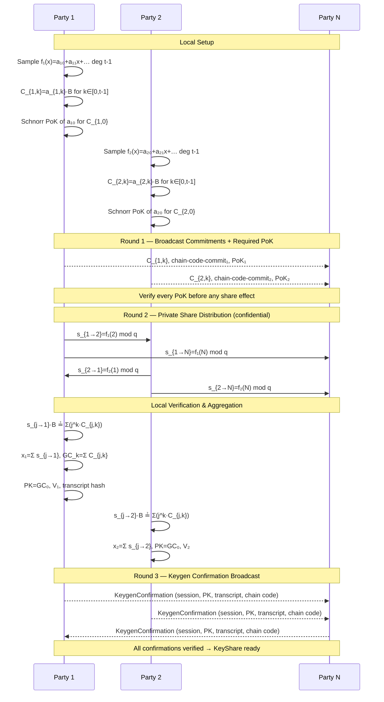
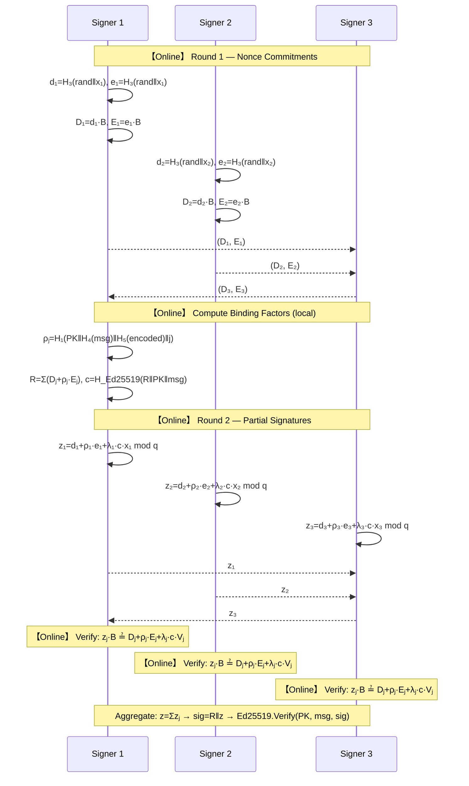
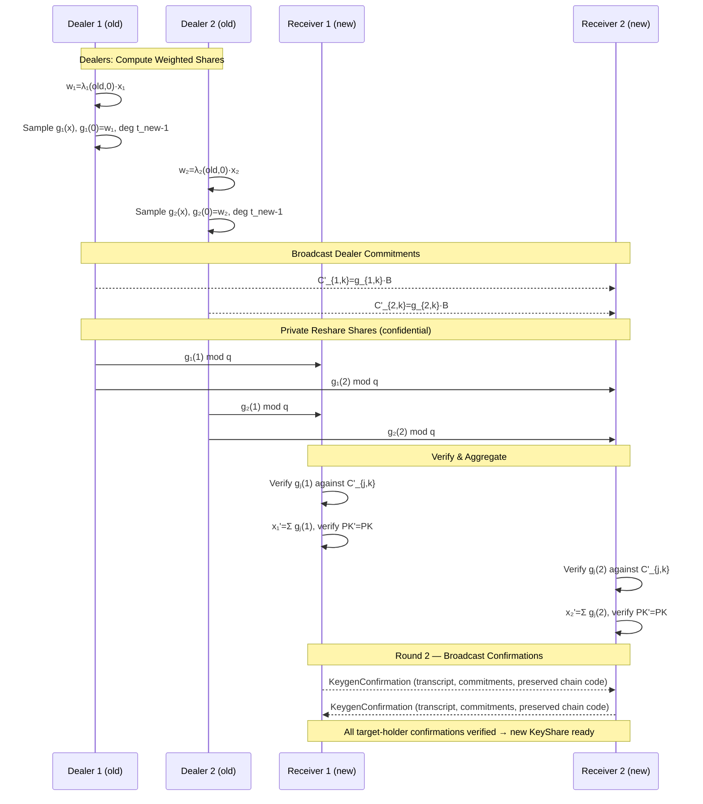
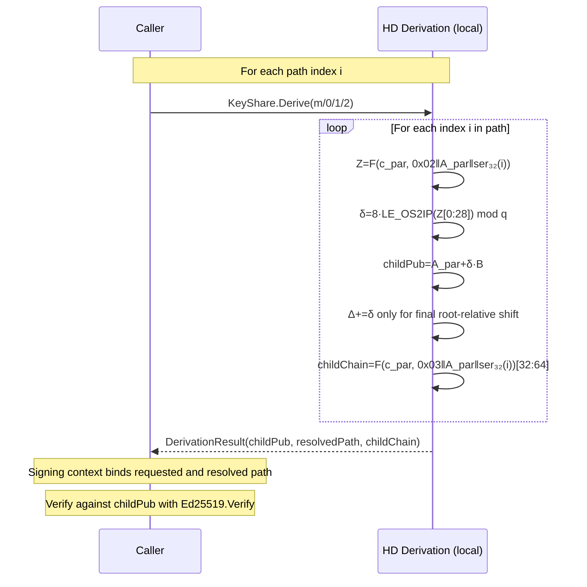

# FROST Ed25519

The `frost/ed25519` package combines the dealerless key-generation protocol from
the [original FROST paper](https://eprint.iacr.org/2020/852) with the two-round
Ed25519 signing protocol from
[RFC 9591](https://www.rfc-editor.org/rfc/rfc9591). RFC 9591 specifies signing,
not dealerless key generation. Repository-defined lifecycle confirmation,
production nonce binding, refresh, reshare, and HD derivation are documented as
extensions rather than RFC behavior.

## Protocol Overview

| Phase     | Rounds | Description                                                               |
| --------- | ------ | ------------------------------------------------------------------------- |
| DKG       | 3      | Proof-carrying commitments, confidential shares, repository confirmation. |
| Signing   | 2      | RFC 9591 nonce commitment, then partial signature.                        |
| Resharing | 2      | Reshare/refresh shares, then target-holder confirmations.                 |
| BIP32 HD  | local  | Khovratovich-Law non-hardened child key derivation.                       |

The group public key is a standard Ed25519 verification key. Signatures are standard 64-byte `R || S` Ed25519 values verifiable with `crypto/ed25519.Verify`.

## Session Transition Contract

FROST keygen, signing, refresh, and reshare handlers follow:

```text
decode -> policy validate -> cryptographic verify -> prepare transition -> commit -> effects
```

Rejected messages do not mutate accepted commitments, shares, partials, or
completion state. Decoded secret scalars and prepared nonce/share outputs remain
owned by the transition until commit and are destroyed on rejection. Outbound
envelopes are fully constructed before the corresponding state is committed.
Identical duplicates never reapply state; conflicting duplicates are rejected
without overwriting accepted values. Completion readiness is derived from the
accepted per-party state.

## Production Run Recipes

The recipes below describe production integration metadata. They do not add a
new library API. A shared plan means equivalent authenticated run metadata, not
a shared Go object.

### FROST KeygenRun

Public run metadata includes a fresh keygen session ID, parties, threshold, and
any application key identifier. Each party validates the metadata, reconstructs
`NewKeygenPlan`, records the plan digest acceptance, builds an `EnvelopeGuard`
for `tss.ProtocolFROSTEd25519` and the same session ID, calls `StartKeygen`
locally, dispatches inbound envelopes to `KeygenSession.Handle`, and routes any
returned envelopes.

Round 1 broadcasts coefficient commitments, the chain-code commitment, and a
required constant-term Schnorr proof. A party emits its round-2 confidential
shares only after it has verified every round-1 proof. Round 3 broadcasts the
repository confirmation and chain-code reveal.

The keygen session ID is stored in `KeyShare` metadata after completion.
`KeygenSession.KeyShare()` becomes available only after the confirmation round.
Persist the encrypted local key share before marking the party complete or the
key usable.

### FROST SignRun

Public run metadata includes a fresh signing session ID, key ID or key
generation ID, signer set, message, and any signing context or derivation
request. Each signer reconstructs `NewSignPlan`, calls `StartSign`, routes
nonce commitments and partial signatures through `SignSession.Handle`, and
verifies the final signature before exposing the result.

HD derivation is local/public context resolution, not an interactive run. The
signing run must bind the resolved derivation context.

### FROST RefreshRun

Public run metadata includes a fresh refresh session ID, current key generation
ID, and the current public key metadata. The plan digest binds the source
lifecycle session ID, transcript hash, lifecycle plan hash, and group
commitments hash, so shares from different source generations cannot enter the
same run. Each party reconstructs
`NewRefreshPlan` from its current local `KeyShare`, calls `StartRefresh`, routes
`ReshareSession.Handle`, and obtains the staged output through
`ReshareSession.KeyShare()`.

Refresh preserves party set, threshold, group public key, and chain code.
Install the refreshed `KeyShare` with compare-and-swap semantics against the
expected current key generation.

### FROST ReshareRun

Public run metadata includes a fresh reshare session ID, old key generation ID,
old parties, new parties, and new threshold. Old parties act as dealers and call
`StartReshare`. New-only recipients call `StartReshareRecipient`. New-only
recipients need public reshare metadata out of band before starting the
recipient flow: old public key, chain code, party set, group commitments,
lifecycle session ID, transcript hash, and lifecycle plan hash. All roles route
`ReshareSession.Handle`, including the round-2 confirmations returned by it.
An old-only dealer remains active after round 1: it derives the public
confirmation binding from the complete dealer commitment set and completes only
after verifying confirmations from every target key holder. It never receives
a secret share or exposes a new `KeyShare`.

The control plane owns old/new generation cutover and must not retire the old
generation until the required new-generation commit condition is satisfied. It
must keep old-only dealer sessions registered through the confirmation round;
new-holder completion itself does not depend on every removed dealer observing
that final round.

Refresh and reshare restart tests exercise this boundary through the shared
clone-on-read, compare-and-swap `internal/testharness.CrashyStore`. A crash
before persistence recovers only the source generation, which remains usable by
the old committee. A crash after persistence, or an unknown commit outcome,
must re-read the authoritative store and recover only the target generation,
which is usable by the target committee. A definite non-commit destroys the
candidate; an unknown outcome retains callback ownership until reconciliation
and never authorizes selection from an in-memory guess.

## Trusted-Dealer Import and Secret Reconstruction

`NewTrustedDealerImport` splits an existing group secret into non-zero additive
contributions, one per participant. The public `TrustedDealerImportPlan` binds
the target public key and chain code, the session, party set, threshold, each
constant-term commitment, and each chain-code commitment. Contributions are
secret-bearing canonical records and must be provisioned to exactly one party
through a confidential caller-managed channel.

`TrustedDealerImportPlan.Snapshot()` returns caller-owned public data.
`Commitments` means the per-party constant-term commitments; the separate
`ChainCodeCommitments` map contains deep-copied per-party chain-code
commitments. This additive snapshot field does not change the plan digest or
wire shape.

Each party calls `StartTrustedDealerImport`. From round 1 onward this is the
ordinary keygen state machine and the existing keygen payload shapes. Every
degree-zero polynomial commitment must match the plan before state mutation;
every participant must also prove knowledge of that constant term, including
1-of-1 and full-threshold ceremonies. Completion rechecks the target public key
and XOR-aggregated chain code.
`GenerateTrustedDealerKeyShares` runs those same sessions through an
authenticated in-memory router for centralized provisioning and returns
caller-owned `KeyShare` values that must be encrypted before distribution.

`ReconstructSecretKey` accepts at least the threshold number of unique shares,
requires every share to belong to the exact same lifecycle generation, and
interpolates the secret at zero without consuming the inputs. The returned
`SecretKey` exports a canonical 32-byte little-endian group scalar. It is not an
RFC 8032 seed: `NewSecretKeyFromSeed` is one-way and reconstruction cannot
recover the original seed.

## KeyShare API and Ownership

`KeyShare` is an opaque handle. Public metadata cannot be changed through struct
fields after validation. `PartyID()`, `Threshold()`, and `KeygenSessionID()`
return scalar values. `PublicMetadata()` returns a caller-owned snapshot of the
party set, group public key, chain code, group commitments, session binding,
transcript hash, and plan hash. Per-party public material is queried with
`VerificationShare(party)` and `KeygenConfirmation(party)`.

The persistent per-party material is keyed by `PartyID`. Its key set must match
the canonical participant set exactly. Ordered transcript and confirmation
material is always derived from the participant order, never Go map iteration.
The current map-based KeyShare wire layout intentionally does not decode the
retired record-list layout.

Keygen, refresh, reshare, and sign plans expose aggregate caller-owned values
through `Snapshot()` methods rather than independent slice and byte getters.

The local share is stored as `internal/secret.Scalar` fixed-length bytes.
`String()`, `GoString()`, and `Format()` redact it, while `MarshalJSON()` rejects
the record. `Destroy()` zeroes the package-owned secret and chain code in place.
A shallow Go copy is only another handle to that same lifecycle state.
`KeyShare.Derive` revalidates the complete share and its secret/public
consistency before using public derivation metadata, so a destroyed or
inconsistent share fails closed. Public-only derivation from an independently
validated metadata snapshot remains available through `DeriveNonHardenedBIP32`.
Successful `UnmarshalBinary` and `UnmarshalWireMessage` calls destroy any
superseded receiver secret and chain code only after the replacement has fully
decoded and validated; failed decoding leaves the receiver unchanged.
`KeygenSession.KeyShare()` and reshare completion accessors return independently
owned shares that must each be destroyed separately.

## Distributed Key Generation

### Polynomial Sampling

Each party `i` samples a random polynomial over the Ed25519 prime-order scalar field:

```
f_i(x) = a_{i,0} + a_{i,1}·x + … + a_{i,t-1}·x^{t-1}  (mod q)
```

where `t` is the threshold and `q` is the Ed25519 scalar order (`2^252 + 27742317777372353535851937790883648493`).

### Round 1: Commitments and Constant-Term Proof

Each party publishes Feldman-style coefficient commitments:

```
C_{i,k} = a_{i,k} · B          for k ∈ [0, t-1]
```

where `B` is the Ed25519 base point. The round-1
`keygenCommitmentsPayload` broadcasts those commitments, the dealer's
chain-code commitment, and a required Schnorr proof of knowledge for the
constant coefficient `a_{i,0}`. The proof is required for every threshold and
for both dealerless and trusted-dealer-import flows; there is no 1-of-1,
full-threshold, or trusted-import exception. The payload keeps schema version 1
and requires the nested proof at tag 4; the retired three-field body is rejected
without a fallback decoder.

For public statement `C_{i,0} = a_{i,0}·B`, the prover samples a secret nonce
`r`, publishes a canonical non-identity prime-order point `R = r·B`, derives a
canonical non-zero challenge `c`, and returns a canonical response `μ`:

```
μ = r + c·a_{i,0}  mod q
μ·B  ≟  R + c·C_{i,0}
```

The nested proof wire record encodes `R` at tag 1 and `μ` at tag 2.

A zero response is valid when it satisfies the equation. The nonce is a
one-use `internal/secret.Scalar` and is destroyed after finalization, failure,
or cancellation. It is sampled after the polynomial, local share, and chain
code so adding the proof does not reorder deterministic key-material RNG. The
challenge uses a labeled SHA-256 transcript and rejection sampling rather than
biased modular reduction, with a fixed limit of 256 candidates. It binds the protocol and
version, ciphersuite, session, round 1, dealer, threshold, canonically sorted
complete party set, plan hash, every coefficient commitment, chain-code
commitment, `C_{i,0}`, and `R`. This proof prevents a dealer from choosing its
constant commitment as a function of the other dealers' commitments without
knowing the corresponding secret, the rogue-key attack addressed by the
original FROST paper.

### Round 2: Confidential Share Distribution

Each party computes private shares for every other party and delivers them in confidential point-to-point envelopes:

```
s_{i→j} = f_i(j)   (mod q)
```

The share is encoded as a canonical 32-byte scalar and sent as a direct
confidential message (`To != 0`, transport must report `ChannelConfidential` in
`ReceiveInfo`). No dealer emits any round-2 share until it has received and
verified the complete round-1 proof set. A round-2 share that arrives early may
occupy only its sender's bounded pending slot; it cannot advance the state and
is fully revalidated against the accepted commitment before promotion.

### Share Verification

Each receiver `j` verifies share `s_{i→j}` against dealer `i`'s commitments:

```
s_{i→j} · B  ≟  Σ_{k=0}^{t-1} (j^k · C_{i,k})
```

A failed verification returns an attributable terminal verification error. For
a malformed or invalid public round-1 commitment/proof, evidence may bind the
actual public envelope digest with
`EvidenceKindFrostKeygenCommitment`. For a confidential round-2 share, evidence
uses a synthetic envelope that binds only the sender's slot, party-set hash, and
commitments hash. It never records the share, original confidential payload, or
either one's hash. Authenticated malformed round-1 or round-2 payloads,
non-canonical values, invalid proofs, and invalid shares abort the session,
produce no outbound effects, and clear pending secret state. Guard-layer
rejections and the existing plan-hash-mismatch path retain their separate
nonterminal semantics and do not manufacture cryptographic blame.

### Round 3: Repository Confirmation and Completion

When all `n` dealers' commitments and shares are collected and verified:

1. **Secret aggregation:** `x_j = Σ_{i=1}^{n} s_{i→j} mod q`
2. **Group commitments:** For each degree `k`, `GC_k = Σ_{i=1}^{n} C_{i,k}`
3. **Group public key:** `PK = GC_0` (the aggregated degree-zero commitment)
4. **Verification shares:** For each party `p`, `V_p = Σ_{k=0}^{t-1} (p^k · GC_k)`
5. **Chain code:** After the round-3 commit/reveal check, `chain = XOR_{i=1}^{n} chainCode_i`.
6. **Transcript hash:** Labeled, domain-separated SHA-256 binding the ciphersuite context, protocol, version, session ID, threshold, sorted parties, plan hash, the aggregate of the round-1 chain-code commitments, every dealer commitment set, the canonical proof bytes verified for every dealer, group commitments, and verification shares. This value is identical for every party in the completed DKG.

Every `V_p` must decode as a canonical, non-identity prime-order element.
An identity at any participant index means that participant's scalar share is
zero and is therefore public. DKG, refresh, and reshare treat this aggregate
condition as an unblamed verification failure, terminally abort, and clear
their staged secret material. Standalone `VerificationShare` and persisted
`KeyShare` validation and decoding enforce the same invariant.

At this point the session has only local pending material. It then broadcasts a
round-3 `KeygenConfirmation` payload binding the session ID, sender, threshold,
party set, group public key, keygen transcript hash, and group commitments hash.
Because the transcript hash binds every dealer commitment set, proof, and the
aggregate chain-code commitment, any equivocated broadcast view produces a
mismatching confirmation. Round 3 separately checks every revealed chain code
against its round-1 commitment before deriving the final aggregate chain code.

`KeygenSession.KeyShare()` returns `false` until confirmations from every party
are received, canonical, non-confidential broadcasts, and consistent with the
local pending material. The resulting `KeyShare` stores the local scalar share
`x_j`, group public key `PK`, group commitments, verification shares, chain
code, keygen session ID, keygen transcript hash, and keygen confirmation
evidence.

A canonical confirmation that arrives before the local pending key material is
ready is held in that sender's bounded pending slot. It is verified and promoted
only after its prerequisites are accepted, so transport reordering does not
weaken the phase checks.

### Domain Separation

Keygen commitment hashing uses the label
`frost-ed25519-keygen-commitments-v1`. The constant-term proof uses
`frost-ed25519-keygen-constant-proof-v1` and the complete statement described
above.

Repository-defined FROST transcript fields use the canonical labeled-entry
encoding documented in [`wire.md`](wire.md). Party sets are sorted and encoded
as canonical uint32 lists; dealer and verification-share records repeat their
party ID before the associated public fields. The keygen transcript binds the
aggregate of the round-1 chain-code commitments, not the final aggregate chain
code, and binds the canonical proof bytes actually verified for each dealer.
RFC 9591 `H1`/`H4`/`H5` retain their RFC-defined SHA-512 concatenation for the
separate signing protocol.

## Signing

Signing operates in two rounds. `DefaultLimits()` accepts any canonically
ordered signer subset with `threshold <= len(signers) <= n`. Applications that
require exactly the threshold number of signers may supply `Limits` with
`Threshold.AllowOversizedSignerSet = false`; this policy choice is not part of
the sign-plan digest, while the actual signer set is.

### Round 1: Nonce Commitments

Each signer `i` derives two hedged nonces from the RFC 9591 `H3` inputs plus a
repository-defined context binding:

```
d_i = H3(random32 || SerializeScalar(x_i) || nonce_context("hiding"))
e_i = H3(random32 || SerializeScalar(x_i) || nonce_context("binding"))
```

`nonce_context` binds the signing session ID, message, signing-context hash,
sign-plan hash, and nonce role. This prevents repeated `NonceReader` output from
reusing the same nonce across different signing intents. `random32` comes from
`SignRuntime.Local.Rand` or `crypto/rand.Reader`; custom readers must still be
CSPRNGs and must not intentionally repeat output. `SignOptions.NonceReader`
serves the in-memory simulation helper.
The session stores the canonical nonce bytes only until the round-2 partial is
constructed. After that point the nonce bytes are cleared and set to `nil`.
The public commitment map and retained local commitment envelope remain only
until terminal success, abort, or `Destroy`, when they are also released.

The signer broadcasts the public commitments:

```
D_i = d_i · B
E_i = e_i · B
```

These are sent as a `nonceCommitment` payload in a round-1 broadcast envelope.
Each point must have one canonical, non-identity prime-order encoding. An
authenticated signer that sends an invalid commitment is blamed from the public
envelope evidence (`EvidenceKindFrostNonceCommitment`), and the recipient aborts
the signing session and clears its local nonces as required by RFC 9591 Section
5.2.

### Binding Factor

After collecting all signers' nonce commitments, each signer computes the binding factor `ρ_i` (per RFC 9591):

```
encoded = Σ SerializeScalar(i) || D_i || E_i   // sorted by participant id
msg_hash = H4(message)
commitment_hash = H5(encoded)
ρ_i = H1(PK || msg_hash || commitment_hash || SerializeScalar(i))
```

`PK` is the actual verification key for the signature: the original group key
for normal signing, or the shifted child key when HD additive signing is used.
`H1`, `H4`, and `H5` use the RFC 9591 Ed25519 ciphersuite context string
`"FROST-ED25519-SHA512-v1"` with the `"rho"`, `"msg"`, and `"com"` labels.

### Group Commitment

Each signer computes the group nonce commitment `R`:

```
R = Σ_{j} (D_j + ρ_j · E_j)
```

If `R` is the identity point, the session returns an unblamed terminal
verification error attributed to the broadcast aggregate rather than to an
individual signer. It emits no partial-signature effects and clears the nonces,
commitments, partials, message copy, derivation state, and staged signature.
This event has negligible probability for honest nonces, but it is handled as a
fixed failure state rather than a retryable round rollback.

### Round 2: Partial Signatures

Each signer computes the Ed25519 challenge:

```
c = H_Ed25519(R || PK || message)   mod q
```

The Lagrange coefficient `λ_i` for signer `i` among the signing set:

```
λ_i = Π_{j∈S, j≠i}  j / (j - i)   mod q
```

The partial signature is:

```
z_i = d_i + ρ_i·e_i + λ_i·c·x_i   mod q
```

With an HD additive shift `δ`:

```
z_i = d_i + ρ_i·e_i + λ_i·c·(x_i + δ)   mod q
```

The signing session clears `d_i` and `e_i` immediately after the partial
payload is constructed. After successful aggregation it also clears its message
copy, partial scalars, retained partial envelopes, commitment map, and local
commitment envelope while preserving the final signature. Call
`SignSession.Destroy()` when the session is no longer needed to clear the
remaining session-owned material on a best-effort basis.

An authenticated signer whose round-2 partial payload cannot be decoded,
including a scalar outside `[0, q-1]` or with any of its top three bits set, is
blamed from the public envelope evidence
(`EvidenceKindFrostPartialSignature`). The recipient terminally aborts and
clears its nonce and signing state as required by RFC 9591 Sections 5.3 and 7.4.

### Aggregation and Verification

Each signer verifies every received partial `z_j` before aggregation:

```
z_j · B  ≟  D_j + ρ_j·E_j + λ_j·c·V_j
```

where `V_j` is the signer's verification share from DKG.

After all partials are verified, the aggregate is:

```
z = Σ_{j∈S} z_j   mod q
```

The final signature is the standard 64-byte Ed25519 value:

```
sig = R || z
```

This is verified with `crypto/ed25519.Verify(PK, message, sig)`. Because every
partial has already passed its per-signer equation, a failed final verification
is treated as a local invariant or dependency failure: the session aborts with
no signer blame.

### Signing Entry Point

Applications create a shared sign plan and run one `SignSession` per signer with
`StartSign`. The `tss.SigningContext` binds the key, chain, derivation path,
policy domain, and message domain without changing the message bytes:

```go
ctx := tss.SigningContext{
    KeyID: "key-1", ChainID: "chain-1",
    Derivation: tss.DerivationRequest{
        Scheme: tss.DerivationSchemeEd25519KhovratovichLaw,
        Path: tss.MustParseDerivationPath("m/0/1"),
    },
    PolicyDomain: "policy", MessageDomain: "app",
}
plan, err := ed25519.NewSignPlan(ed25519.SignPlanOption{
    Key: share, SessionID: sessionID, Signers: signers, Context: ctx, Message: message,
})
session, out, err := ed25519.StartSign(share, plan, ed25519.SignRuntime{
    Local: tss.LocalConfig{Self: self},
    Guard: guard,
})
```

## Resharing

Resharing updates the threshold or participant set while preserving the group
public key. True resharing requires all old parties to be online as dealers.
`StartRefresh` is the same-party proactive-refresh variant.

### Protocol

For true resharing, each party `i` from the original participant set:

1. Computes `w_i = λ_i(old, 0) · x_i`.
2. Samples `g_i(x)` where `g_i(0) = w_i` and `deg(g_i) = threshold_new - 1`.
3. Broadcasts commitments `C'_{i,k} = g_{i,k}·B`.
4. Sends private shares `g_i(j)` to each party `j` in the new participant set.

Each receiver `j` verifies each share against its dealer's commitments, then computes:

Receivers verify dealer shares in canonical old-party order. If more than one
dealer share is invalid, every receiver attributes the first invalid dealer in
that order so the protocol error and blame evidence remain deterministic.

```
x'_j = Σ_i g_i(j)   mod q
```

Since `Σ_i g_i(0)` reconstructs the old group secret, the group public key is
preserved. `StartRefresh` instead uses zero-constant polynomials and adds the
refresh shares to the existing local share.

New group commitments are the sum of all reshare commitments, plus the old
commitments in refresh mode. The chain code is preserved from the original key
metadata. The reshare/refresh transcript hash is global across recipients and
binds old and new party sets, the old public key, chain code, refresh mode, all
dealer commitments, new commitments, and verification shares. `StartRefresh`
requires `config.Self` to match the supplied old key's party id. A new recipient
that does not hold an old `KeyShare` must receive the authenticated source
metadata listed under FROST ReshareRun and pass it to `NewPublicResharePlan`.

After round 1, each target key holder stages its locally derived share and
broadcasts a round-2 confirmation binding the reshare session, plan, target
party set and threshold, preserved public key and chain code, transcript hash,
and new commitments hash. `ReshareSession.KeyShare()` remains unavailable until
confirmations from every target key holder agree. Serialized key shares require
this complete confirmation set; removing every confirmation is rejected rather
than treated as an older valid shape. Removed old dealers derive the same
confirmation binding from public commitments and remain incomplete until they
have verified the full target confirmation set; their `KeyShare()` accessor
always remains unavailable.

## BIP32 HD Derivation

The package implements non-hardened BIP32-Ed25519 derivation following the
[Khovratovich-Law paper](https://doi.org/10.1109/EuroSPW.2017.47).

### Derivation

Use `KeyShare.Derive(path)` or `DeriveNonHardenedBIP32(pubKey, chainCode, path)`
to resolve a path into a `tss.DerivationResult` containing the child public key,
child chain code, resolved path, and internal additive shift.

For path level `j` with non-hardened index `i_j`:

1. `Z_j = HMAC-SHA512(c_{j-1}, 0x02 || A_{j-1} || ser_32(i_j))`
2. `δ_j = 8 · LE_OS2IP(Z_j[0:28]) mod q` (cofactor clearing)
3. `A_j = A_{j-1} + δ_j·B`
4. `c_j = HMAC-SHA512(c_{j-1}, 0x03 || A_{j-1} || ser_32(i_j))[32:64]`

The implementation also accumulates `Δ = Σ_j δ_j mod q` for threshold signing,
but that accumulator is used only for the final equivalent relation
`A_j = A_root + Δ·B`. Each next HMAC input and public-key update uses the
immediately preceding `A_{j-1}` and `c_{j-1}`; it never adds the cumulative
shift to an already shifted parent.

For public derivation, a zero `δ_j` is valid: the public point stays unchanged
while the child chain code advances. The invalid-child condition is instead
`childPub == identity`, matching the paper. `ErrorOnInvalidChild` returns
`ErrInvalidChild`; `SkipInvalidChild` increments the index and recomputes both
the tweak and chain code until it reaches a valid non-hardened child.

Only non-hardened indices (`i < 2^31`) are supported since hardened derivation
requires the full private key, which no single party holds. A path contains at
most `tss.MaxDerivationDepth = 255` levels.

### Signing with HD

Bind the derivation path into the signing context before constructing the signing plan:

```go
ctx := tss.SigningContext{
    KeyID: "key-1", ChainID: "chain-1",
    Derivation: tss.DerivationRequest{
        Scheme: tss.DerivationSchemeEd25519KhovratovichLaw,
        Path: tss.MustParseDerivationPath("m/0/1/2"),
    },
    PolicyDomain: "policy", MessageDomain: "app",
}
plan, err := NewSignPlan(SignPlanOption{
    Key: share, SessionID: sessionID, Signers: signers,
    Context: ctx, Message: message,
})
runtime := SignRuntime{
    Local: tss.LocalConfig{Self: share.PartyID()},
    Guard: guard,
}
sess, out, err := StartSign(share, plan, runtime)
```

Each signer derives the same child key from the context path and adds the internal shift during partial generation. The resulting signature verifies against the child public key:

```go
crypto/ed25519.Verify(plan.VerificationKeyBytes(), message, sig) // true
```

## RFC 9591 Alignment

| Feature              | Implementation                                                         |
| -------------------- | ---------------------------------------------------------------------- |
| Context string       | `"FROST-ED25519-SHA512-v1"` per RFC 9591 §6.1                          |
| Ciphersuite          | Ed25519-SHA512 with the standard Ed25519 challenge                     |
| Nonce generation     | RFC 9591 `H3` input plus a repository-defined signing-intent binding   |
| Binding factor       | RFC 9591 `H1` over `PK`, `H4(msg)`, `H5(encoded commitments)`, and `i` |
| Scalar encoding      | 32-byte little-endian canonical scalar encoding                        |
| Point encoding       | 32-byte compressed Edwards y-coordinate                                |
| Group commitment     | `R = Σ (D_j + ρ_j·E_j)` per RFC 9591                                   |
| Partial verification | Per-signer before aggregation with attributable blame                  |
| Signature format     | Standard 64-byte Ed25519 signature, `R` followed by `S`                |

### Differences from RFC 9591

- RFC 9591 does not define dealerless key generation. The default three-round
  DKG follows the original FROST paper's proof-of-knowledge requirement and
  adds a repository confirmation round. Trusted-dealer import is an explicit
  alternative whose plan and contributions enter that same proof-gated DKG.
- Production nonce derivation appends a labeled hash of the session ID,
  message, signing-context hash, sign-plan hash, and nonce role to the RFC
  `random32 || SerializeScalar(x_i)` input. Only the Appendix E.1 signing vector
  calls the exact RFC primitive explicitly; end-to-end tests that use repository
  DKG or production nonce binding are repository-extension tests, not complete
  RFC flows.
- Wire envelopes are this library's transport-neutral TLV messages, not an RFC wire format.
- `Signature()` returns a plain `[]byte` rather than a structured `(R, z)` tuple — the caller can split on the 32-byte boundary if needed.

## Payload Types

| Payload Type                         | Round | Direction      | Confidential | Content                                          |
| ------------------------------------ | ----- | -------------- | ------------ | ------------------------------------------------ |
| `frost.ed25519.keygen.commitments`   | 1     | broadcast      | no           | Polynomial/chain-code commitments + required PoK |
| `frost.ed25519.keygen.share`         | 2     | point-to-point | yes          | Scalar share for one recipient                   |
| `frost.ed25519.keygen.confirmation`  | 3     | broadcast      | no           | Completed DKG binding + chain-code reveal        |
| `frost.ed25519.sign.commitment`      | 1     | broadcast      | no           | `(D, E)` nonce commitments                       |
| `frost.ed25519.sign.partial`         | 2     | broadcast      | no           | Partial signature scalar `z_i`                   |
| `frost.ed25519.reshare.commitments`  | 1     | broadcast      | no           | Reshare polynomial commitments                   |
| `frost.ed25519.reshare.share`        | 1     | point-to-point | yes          | Reshare scalar for one recipient                 |
| `frost.ed25519.reshare.confirmation` | 2     | broadcast      | no           | Completed reshare/refresh binding                |

## Sequence Diagrams

### Protocol Flow Summary

```
DKG (3 Rounds) ──→ Signing (Online, 2 Rounds)
              │
              │  no offline pre-computation
              │  message required at round 1
              │  produces standard 64-byte Ed25519 signature
              │
         Reshare / Refresh (maintenance, PK preserved)
              │
         BIP32 HD Derivation (local, no network rounds)
```

### DKG — Distributed Key Generation (3 Rounds)

Round 1 broadcasts polynomial and chain-code commitments plus the required
constant-term proof. Only after all proofs verify does round 2 distribute
confidential Shamir shares. Round 3 reveals chain-code contributions and
cross-verifies repository confirmations against the local transcript.



### Signing — Online (2 Rounds)

**Online phase**: FROST has no offline pre-computation phase. The 2-round online signing requires the actual message at round 1 and produces a standard 64-byte Ed25519 signature `R‖z`. Partial signatures are verified per-party before aggregation.

Round 1: nonce commitment broadcast. Round 2: partial signature exchange with per-party verification before aggregation.



### Resharing (2 Rounds)

Changes participant set and/or threshold while preserving the group public key. Dealers (old parties) sample weighted polynomials and distribute shares to new receivers.



### Same-Party Refresh (2 Rounds)

Proactive refresh preserving the participant set and threshold. Each party samples a zero-constant polynomial and adds shares to the existing key.

```mermaid
sequenceDiagram
    participant P1 as Party 1
    participant P2 as Party 2
    participant PN as Party N

    Note over P1,PN: Local Setup
    P1->>P1: Sample g₁(x) with g₁(0)=0, deg t-1
    P2->>P2: Sample g₂(x) with g₂(0)=0, deg t-1

    Note over P1,PN: Broadcast Commitments
    P1-->>PN: C'_{1,k}=g_{1,k}·B
    P2-->>PN: C'_{2,k}=g_{2,k}·B

    Note over P1,PN: Private Refresh Shares (confidential)
    P1->>P2: g₁(2) mod q
    P1->>PN: g₁(N) mod q
    P2->>P1: g₂(1) mod q
    P2->>PN: g₂(N) mod q

    Note over P1,PN: Verify & Aggregate
    P1->>P1: x₁'=x₁+Σ gⱼ(1), verify PK'=PK
    P2->>P2: x₂'=x₂+Σ gⱼ(2), verify PK'=PK

    Note over P1,PN: Round 2 — Broadcast Confirmations
    P1-->>PN: KeygenConfirmation (preserved chain code)
    P2-->>PN: KeygenConfirmation (preserved chain code)

    Note over P1,PN: All confirmations verified → new KeyShare; old commitments were summed with refresh commitments
```

### BIP32 HD Derivation (Local)

Non-hardened Khovratovich-Law child key derivation. Performed locally without network rounds; each signer resolves the same `tss.SigningContext` path and applies the resulting internal shift during partial signature generation.



## API Reference

### Keygen

```go
option := KeygenPlanOption{
    SessionID: sessionID, Parties: parties, Threshold: threshold,
}
plan, err := NewKeygenPlan(option)
kg, out, err := StartKeygen(plan, tss.LocalConfig{Self: self, Rand: rng}, guard)
out, err := kg.Handle(env)
share, ok := kg.KeyShare()
metadata, ok := share.PublicMetadata()
publicKey := metadata.PublicKey.Bytes()
parties := metadata.Parties
```

### Signing

```go
plan, err := NewSignPlan(SignPlanOption{
    Key: share, SessionID: sessionID, Signers: signers,
    Context: ctx, Message: message,
})
runtime := SignRuntime{
    Local: tss.LocalConfig{Self: share.PartyID(), Rand: nonceReader},
    Guard: guard,
}
sess, out, err := StartSign(share, plan, runtime)
out, err := sess.Handle(env)
sig, ok := sess.Signature()
```

### Resharing

```go
plan, err := NewResharePlan(ResharePlanOption{
    OldKey: oldShare, SessionID: sessionID,
    NewParties: newParties, NewThreshold: newThreshold,
})
sess, out, err := StartReshare(oldShare, plan, tss.LocalConfig{Self: oldShare.PartyID(), Rand: rng}, guard)
recipientPlan, err := NewPublicResharePlan(PublicResharePlanOption{
    OldPublicKey: oldPublicKey, OldChainCode: oldChainCode, OldParties: oldParties,
    OldGroupCommitments: oldGroupCommitments,
    OldKeygenSessionID: oldKeygenSessionID,
    OldKeygenTranscriptHash: oldKeygenTranscriptHash,
    OldPlanHash: oldPlanHash,
    SessionID: sessionID, NewParties: newParties, NewThreshold: newThreshold,
})
recipient, err := StartReshareRecipient(recipientPlan, tss.LocalConfig{Self: self}, guard)
refreshPlan, err := NewRefreshPlan(RefreshPlanOption{OldKey: oldShare, SessionID: sessionID})
refresh, out, err := StartRefresh(oldShare, refreshPlan, tss.LocalConfig{Self: oldShare.PartyID(), Rand: rng}, guard)
out, err := sess.Handle(env)
newShare, ok := sess.KeyShare()
```

Old committee members call `StartReshare` and act as dealers. A participant
that is only in the new committee calls `StartReshareRecipient` with the old
authenticated source-generation public metadata so the completed share can verify
`oldPK == newPK` and preserve HD derivation metadata. Same-party proactive
refresh uses `StartRefresh`, which preserves the participant set and threshold.

### BIP32 HD

```go
path := tss.MustParseDerivationPath("m/0/1/2")
result, err := share.Derive(path)
childPub := result.ChildPublicKey
childChain := result.ChildChainCode
```

### Convenience

```go
share, err := UnmarshalKeyShare(raw)
```

## Scope and Limitations

- Signs raw messages only. Ed25519ph and Ed25519ctx are not exposed.
- No network transport, storage encryption, or peer authentication.
- Group public key is a standard Ed25519 key; no on-chain contract verification is provided.
- The protocol depends on Fiat-Shamir challenges via SHA-256/SHA-512; the random oracle assumption applies.
